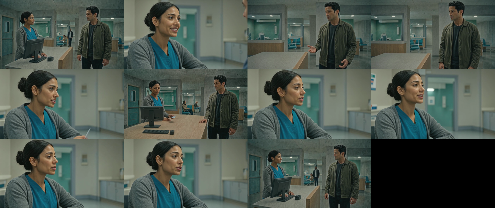

# Cinematic Production Lab

[](https://github.com/AndrewMichael2020/cinematic-production-lab/actions/workflows/dry-run.yml)
[](pyproject.toml)
[](tests)
[](LICENSE)
[](#run-locally)
[](https://github.com/AndrewMichael2020/cinematic-production-lab/releases)

A production-oriented cinematic systems portfolio: story and sequence manifests, bounded model
orchestration, editorial decision records, versioned voices, technical and perceptual QA, FFmpeg
assembly, and explicit human acceptance. The lab treats generation as one department inside a wider
filmmaking workflow—not as the product.

## Portfolio proof



**[Watch the first completed film on YouTube](https://www.youtube.com/watch?v=VnIrfT_vzvI).** The
repository also keeps the accepted
[clinic Stage 2 sequence](runs/clinic-stage2-20260803T060048Z/final/clinic-stage2-sequence-v3.mp4)
and bounded [15-second dialogue continuation](runs/cliffhanger-20260802T235825Z/final-the-call-15s.mp4)
playable in place. These existing README artifacts remain part of the portfolio evidence.

| Evidence | Decision | What it shows |
|---|---|---|
| [First completed film](https://www.youtube.com/watch?v=VnIrfT_vzvI) | Published | End-to-end cinematic result |
| [Accepted Stage 2 run](runs/clinic-stage2-20260803T060048Z/RUN-REPORT.md) | Accepted | Delivery, edit, QA decisions, cost/provenance records, and retained proof |
| [15-second continuation](runs/cliffhanger-20260802T235825Z/final-the-call-15s.mp4) | Accepted bounded proof | Master-plus-coverage dialogue assembly and compact evidence |
| [Full-clinic postmortem](docs/CLINIC-FULL-SEQUENCE-POSTMORTEM.md) | Rejected | Voice-persona and lip-sync failure, root cause, and restart gates |
| [Zero-cost sample](examples/portfolio-dry-run/README.md) | Reproducible | Credential-free scene compilation and ±80 ms AV-offset evaluator calibration |
| [Dry-run workflow](.github/workflows/dry-run.yml) | Automatic | Python 3.11/3.12 tests, credential scan, artifact guard, sample replay, and release build |
| [v0.2.0 release bundle](https://github.com/AndrewMichael2020/cinematic-production-lab/releases) | Bounded | CLI source, sample, expected output, provider snapshot, checksums, and compact proof records |

The same evidence reads differently for the portfolio's target audiences:

| Audience | Signal |
|---|---|
| AI platform engineering | explicit policy boundary, credential-free dry planning, sequential reservations, current model registry, no automatic paid fallback |
| Media engineering | typed timelines, source lineage, hashes, AV-offset evidence, loudness/format checks, deterministic assembly and retention tiers |
| Applied ML and agentic systems | model admission by role, human promotion/acceptance gates, structured observations, failure records, and reproducible clean-run CI |

## Architecture

```mermaid
flowchart LR
    A["Series / episode / sequence / scene manifests"] --> B["Policy preflight: model, price, secrets, voice binding"]
    B --> C["Bounded cost reservation"]
    C --> D{"Execution mode"}
    D -->|"default"| E["Credential-free dry plan"]
    D -->|"manual live + confirm-live"| F["Sequential provider request"]
    F --> G["Cost reconciliation + source provenance"]
    E --> H["Technical QA"]
    G --> H
    H --> I["Perceptual QA: contact sheets + AV offset"]
    I --> J["Normal-speed human review with sound"]
    J -->|"accept"| K["FFmpeg edit, mix, and delivery"]
    J -->|"reject / review"| L["Decision record + bounded repair"]
    K --> M["Hashes, manifest, release asset"]
    L --> N["Compact evidence + local or cold media"]
```



The CLI is the policy boundary. Configuration is validated before orchestration; a live request
needs a current provider snapshot, an approved registered role, capacity under the configured
overall limit, credentials, and two explicit live flags. Voice generation additionally requires a
versioned canonical realization and approved audition hash. Unknown billing or provider state stops
the run; it never triggers an automatic retry or model fallback.

## Editorial system, not just generation

The production vocabulary is shared by human collaborators and agentic tools: series canon,
episode threads, sequences, scenes, beats, setups, source takes, coverage, selects, handles, action
clocks, continuity state, timelines, stems, acceptance decisions, and bounded repairs. That shared
language lets an agent prepare options and preserve lineage while a person retains casting,
promotion, editorial, and final-acceptance authority.

Voice is a production asset, not a request-time string: character persona → versioned realization →
exact audition SHA-256 → immutable dialogue-beat binding. A provider, model, voice, instruction, or
synthesis-setting change creates a new realization and returns to human audition review.

Three principles shape every sequence:

- **Story before shots:** intention, consequence, subtext, viewpoint, and A/B/C thread movement are
  fixed before a provider request.
- **Coverage before rescue:** living masters, motivated setups, eyelines, action continuity, and edit
  handles are planned so assembly is not forced to hide missing storytelling.
- **Sound and time are first-class:** dialogue performance, room tone, semantic ambience, foley,
  music/silence, pacing, cadence, and normal-speed playback are reviewed alongside picture.

See [the production vocabulary](docs/PRODUCTION-VOCABULARY.md),
[the Stage 3 plan](docs/STAGE-3-CINEMATIC-SERIES-PLAN.md), and
[the reproducibility record](docs/REPRODUCIBILITY.md).

## Current goal

Use the completed short-scene proofs to build reproducible, independently replaceable sequences and
then a **5–12+ minute multi-set ensemble episode**:

- multiple authored sets and interwoven A/B/C character plots;
- recurring ensemble personas with immutable visual and voice realizations;
- necessary coverage including living establishing and master shots;
- consistent character descriptions, wardrobe, location, and screen direction;
- credible action, dialogue rhythm, and editing;
- complete cost and provenance records.

The repository contains the Stage 1 golden scene, a 15-second dialogue continuation, and the
completed Stage 2 cinematic-robustness learning cycle. Stage 2 achieved roughly one minute of
concluded two-character dialogue with a convincing clinic world and realistic background chatter—a
major production milestone even though the strongest edit retains visible defects. The engine still
defaults to dry-run mode. Stage 2 adds
series-owned personas and cinematic intent, typed sequence-to-shot lineage, native-generation
orientation checks, face/mouth and action gates, perceptible ambience, outer fades and explicit
human acceptance. Stage 3 is now planned around cinematic craft in all its dimensions: story and
character arcs, theme, narrative viewpoint, screenplay, dialogue and narration, directing and
acting, mise-en-scene, cinematography, storyboarding/previs, editing, sound/music/silence,
compositing, colour/finishing and continuity. No Stage 3 generation is authorized yet.

## Current clinic candidate and latest-run decision

The original ad-hoc expansion, `runs/clinic-full-sequence-20260803T184456Z/`, remains rejected after
normal-speed review found perceptible lip asynchrony and a female-sounding patient voice. Its visual
anchor now drives the Maya/Kenji remediation, where Sarah and Bill are versioned persona-owned voice
realizations rather than request-local aliases.

The failure was architectural. That run created fresh visual personas outside the series-owned
Stage 2 persona manifest. Its `personas.json` describes faces, wardrobe and acting but contains no
voice persona, approved audition, immutable character-to-voice binding or voice-reference hash.
TTS voice names were assigned only inside request provenance, and the run called Kokoro directly
instead of inheriting the configured series casting realization. The previous QA then mistook intact
audio transport and five-fps mouth samples for proof of lip sync. They are not proof: five fps has
200 ms spacing, while the project targets an absolute offset within 80 ms.

Before any new paid or local motion generation, every speaking character must have a versioned voice
persona and approved audition reference, every line must resolve to that exact voice realization,
and every visible utterance must pass normal-speed human review with sound. ASR proves words only;
audio hashes/PSNR prove transport only; neither proves voice identity or audiovisual synchronization.
See [the latest-run postmortem](docs/CLINIC-FULL-SEQUENCE-POSTMORTEM.md).

The Maya/Kenji production plan is encoded in `sequences/clinic-full-cosmos-voice-plan.json`; the v03
shareability repair is encoded in `storyboards/clinic-maya-kenji-cosmos-final-v03.json`. Cosmos3-Super
is limited to the spatial card handoff, while audio-conditioned Wan 2.6 I2V handles visible dialogue.
V03 opens on motion, uses real multi-voice clinic chatter, cuts every speaking picture at the audible
performance boundary, says `BC Services Card`, and uses an official-layout fictional `SAMPLE` prop.
Its master and 480p review copy are in `runs/clinic-cosmos-final-v03/final/`. The automated gate passes;
normal-speed human audiovisual review remains required. The user also identified three honest
carry-forward defects: a transient card-surface blip, slow handoff motion and missing living wide
coverage. They will be solved as general Stage 3 capabilities rather than by another clinic repair.

## Stage 3 direction

Stage 2 is strategically closed even though its strict two-contrasting-sequence exit gate was not
met. Stage 3 now targets one complete 5–12+ minute episode with multiple sets, several independently
motivated character plots and deliberate A/B/C interweaving. It prioritizes:

1. episode architecture with independent A/B/C objectives, turns and meaningful intersections;
2. story intention, character consequence and theme/plot-thread contribution;
3. a locked animatic with living wide/master coverage and an action clock;
4. directing, listening, subtext and performance continuity;
5. editing rhythm, semantic ambience, foley, music/silence and two-device listening;
6. production design, motivated camera/lens/light and stable palette;
7. natural action tempo and deterministically tracked exact props.

Local model benchmarking supports those crafts rather than replacing them. `gpt-5.6-sol` through the
OpenAI Responses API is the planned primary creative brain for story architecture, screenwriting,
preproduction synthesis and difficult reviews; API authentication is intentionally deferred until
the user exposes a key. DeepInfra models remain eligible as bounded secondary evaluators and
fallbacks. LTX 2.3 is the first Apple Silicon video candidate to benchmark. Cosmos3-Super is
explicitly remote-only, with DeepInfra as the known route and an NVIDIA-hosted endpoint considered
only after its exact availability, free allowance and terms are verified.

Every stage start, mid-stage gate and closeout performs a dated web scan of current reasoning and
multimodal models using official provider documentation. Candidates must pass the same filmmaking
evaluation packet before any human-approved change to the primary model. The clinic is retained as
a regression fixture, not as the engine's default genre, tone or project template.
See [the Stage 2 closeout](docs/STAGE-2-CLOSEOUT.md) and
[the complete Stage 3 plan](docs/STAGE-3-CINEMATIC-SERIES-PLAN.md).

## Programmatic model stack

The following table is the historical Stage 1/2 proof stack. The default proof uses one DeepInfra
API token and OSS models. A separately gated,
user-approved partner exception exists only for the bounded lip-sync avatar test.

| Stage | DeepInfra model | Licence | Role |
|---|---|---|---|
| Stage 1/2 planning | `Qwen/Qwen3-32B` | Apache 2.0 | Historical structured shot planning and prompt compilation; not the Stage 3 creative primary |
| Historical/quarantined drafts | `FastVideo/FastWan-QAD-FP8-1.3B` | Apache 2.0 | Early 480p staging tests and the manual connectivity smoke test only; blocked from cinematic sources |
| Final candidates | `Wan-AI/Wan2.2-T2V-A14B` | Apache 2.0 | Selected 5-second 720p generations |
| Physics-aware world candidates | `nvidia/Cosmos3-Super` | OpenMDW 1.1 | Promoted 5-second 720p spatial/physics comparison |
| Visual QA | `Qwen/Qwen3-VL-30B-A3B-Instruct` | Apache 2.0 | Contact-sheet scoring and defect labels |
| Canonical voice casting | `Qwen/Qwen3-TTS` | Apache 2.0 | Named preset plus performance instruction; audition and sequence-wide master |
| Multi-speaker dialogue candidate | `eleven_v3` | ElevenLabs service terms | Human-selected voices, timestamped segments, and separately recorded provider-credit usage |
| Basic speech proof | `ResembleAI/chatterbox-turbo` | MIT | Non-canonical bounded speech tests |
| Audio-conditioned dialogue | `Wan-AI/Wan2.6-I2V` | Provider metadata unspecified | Explicit partner exception for visible synchronized dialogue only |
| Lip-sync test | `PrunaAI/p-video-avatar` | Provider metadata unspecified | Explicit partner exception; disabled by default |
| Assembly | FFmpeg | LGPL/GPL by build | Editing, audio mix, and technical validation |

Unregistered Wan 2.6/Wan 2.7 variants, PixVerse, Veo, direct Gemini API, Vertex AI, and OpenAI API
remain outside the historical Stage 1/2 runtime proof. Stage 3's planned OpenAI lane is separately
gated by the dated model scan, an exposed key, a fixed-packet evaluation and explicit live approval.
A Gemini partner model exposed by DeepInfra may be used
only after its exact ID, role, current price, request limit, and reservation basis are registered.
ElevenLabs is limited to catalog reads and explicitly confirmed dialogue candidates; it does not
authorize motion generation or automatic voice casting.

The DeepInfra video endpoint is:

```text
POST https://api.deepinfra.com/v1/inference/{model}
Authorization: Bearer $DEEPINFRA_TOKEN
```

## Execution and overall budget control

`project.json` sets the overall run limit, provider-account ceiling, per-role candidate limits, and
paid concurrency of one. Before transmission, each paid request reserves its maximum configured
cost; after completion, the ledger reconciles the provider-reported actual. An unknown price,
billing status, or result stops the run without retry or fallback. The named profiles are simply
settings for choosing a conservative overall ceiling—not the focus of the project. Current units
and provider links are recorded in the
[dated provider snapshot](docs/PROVIDER-SNAPSHOT-2026-08-15.md).

## Required secret

Create one repository secret:

```text
DEEPINFRA_API_TOKEN
```

For local runs, expose the same value as `DEEPINFRA_TOKEN`. Dialogue casting additionally uses a
local `ELEVENLABS_KEY`; never commit either key. See [docs/SECRETS.md](docs/SECRETS.md).

ChatGPT/Codex and GitHub Copilot subscriptions may be used to develop and review the repository, but
the production workflow does not pretend they are API credits. Gemini may be called only as an
explicitly registered DeepInfra partner model; no direct Google API credential is required or allowed.

## Intended workflow

1. Author series canon, episode threads, sequence/scene beats, coverage, action clocks, sound intent,
   and acceptance conditions.
2. Run the zero-cost policy preflight, compile prompts, and validate spatial continuity and privacy.
3. Version each speaking persona and hash-bind a human-approved voice audition before motion.
4. Lock an animatic and let a human authorize only the source takes or bounded model comparisons
   worth generating.
5. Reserve the maximum configured cost and send one explicitly confirmed provider request at a time.
6. Run format/stream/hash checks, contact-sheet review, structured defect observations, and—where
   visible speech exists—objective AV-offset evidence plus normal-speed review with sound.
7. Assemble picture, dialogue, ambience, foley, music/silence, fades, and delivery formats in FFmpeg.
8. Preserve the decision, source lineage, prompts, seeds, costs, hashes, voice binding, and QA evidence;
   keep delivery media in the appropriate Git, release, Actions, or local/cold-storage tier.

FastWan is not the cinematic draft lane. It remains quarantined to the separate manual connectivity
smoke test and disposable non-cinematic experiments. Human approval remains required for casting,
paid promotion, bounded repair, editorial acceptance, and final delivery.

## Run locally

The core has no runtime Python dependencies and supports Python 3.11 or later. Install the CLI and
test dependency, then validate the complete dry-run path:

```bash
python -m pip install -e . pytest
video-gen-secret-scan
pytest -q
video-gen preflight --profile cad_10 \
  --output /tmp/cinematic-preflight.json
diff -u examples/portfolio-dry-run/expected/preflight.json \
  /tmp/cinematic-preflight.json
video-gen validate-scene examples/portfolio-dry-run/scene.json \
  --output /tmp/cinematic-scene-plan.json
video-gen audit-av-sync examples/portfolio-dry-run/av-sync-calibration.json \
  --output /tmp/cinematic-av-sync.json
diff -u examples/portfolio-dry-run/expected/av-sync-calibration-report.json \
  /tmp/cinematic-av-sync.json
video-gen validate-stage2 sequences/clinic-reception-stage2.json \
  --output /tmp/clinic-stage2-plan.json
video-gen-release build
video-gen-release verify dist/cinematic-production-lab-v0.2.0.zip
```

`plan-video` reserves the maximum expected charge in the local append-only SQLite ledger but does
not contact DeepInfra. A paid request additionally requires both `--live` and `--confirm-live`, plus
`DEEPINFRA_TOKEN` in the process environment. Final-model requests use the same confirmation as the
human-promotion gate. Successful outputs are downloaded atomically, hashed, and recorded with the
provider request ID and reported cost. Unknown billing status is terminal and is never retried.

Stage 2 assembly uses `prepare-stage2-dialogue`, `generate-clinic-ambience`,
`assemble-stage2`, and `audit-stage2`. These commands reject portrait-origin dialogue and require
the original provider-generation path for every accepted interval; a 16:9 wrapper around a vertical
take cannot pass. The final audit remains in `review` until composition, complete-mouth visibility,
perceptual lip sync, essential action, reference fidelity, persona/voice, ambience audibility and
stitch integrity all have explicit human evidence.

Generated ledgers and media normally live under ignored `runs/` and `outputs/` directories. Existing
README-linked proof stays in Git. New accepted delivery media belongs in a named GitHub release;
raw, intermediate, rejected, and pending-review media stays local or in cold storage. The
[artifact strategy](docs/ARTIFACT-STRATEGY.md) and CI guard prevent accidental repository growth.

When moving to another machine, transfer ignored run folders separately from Git and verify their
final/source hashes after copying. Do not commit `.env`, provider tokens or signed media URLs. On the
M5 Pro, first install Python 3.11+, FFmpeg and the editable package, run `pytest -q`, validate the
series/sequence manifests, and perform only offline voice auditions until the user approves both
canonical voices. Passing hardware or dependency checks does not authorize generation.

The spatial gate runs before generation and checks platform/track geometry, safe blocking, object
support, wardrobe construction, scale, continuity anchors, unwanted text, sparse environmental
symbolism, a required wide master, and explicit interlocutor eyelines. Every planned gaze has a
screen direction and a fail-closed `camera_look_forbidden` flag. `audit-draft` then combines explicit
contact-sheet observations with FFprobe facts. A failed or uncertain criterion blocks promotion.

The optional partner lip-sync path requires `--allow-partner-avatar`, `--live`, and
`--confirm-live` for each sequential speaker request. `plan-avatar` also requires a screen-left or
screen-right gaze. Live avatar images must be public HTTPS URLs; local/data images are rejected before
any reservation because the provider does not fetch inline image data reliably. `prepare-dialogue`
applies bounded trims, a single picture-and-audio rate change,
and a crop without breaking synchronization. `assemble-scene` joins a 2–5 second wide master and
three to five already-synchronized turns, normalizes dialogue to an EBU R128 target, pads only the
final dramatic beat, and emits an output hash manifest. It never activates automatically.

The bounded 15-second continuation in `scenes/platform-cliffhanger.json` used four dialogue turns
and one rejected gaze-calibration take. Its five sequential partner attempts cost US$0.55 actual
against US$1.00 reserved. The final output is 1280×720 with stereo audio; ElevenLabs was not needed.
The ignored run folder retains raw source takes, edit masters, compact actor references, a cost
ledger, manifests, per-shot defect evidence, final QA, and the final contact sheet.

Use `audit-artifacts` before cleanup. `prune-artifacts` is a dry run unless `--apply` is supplied and
only removes previews, sampled-frame sheets, and other deterministic derivatives. It retains raw and
final media, ledgers, manifests, reports, hashes, and compact references fail-closed.

Large failed or rejected media has a separate evidence-gated path: `prune-rejected-media` requires an
explicit decision manifest containing the exact relative path, SHA-256, failed/rejected outcome,
reason, and retained review/lesson files. It defaults to a 25 MiB threshold and dry-run mode. Approved
anchors are protected, and compact lessons, manifests, QA, prompts, hashes, and ledgers are never
treated as large-media cleanup candidates.

The automatic **dry-run** workflow runs on pushes to `main` and pull requests across Python 3.11 and
3.12. It receives no provider credential and never invokes `--live`; it scans tracked files for
credential-shaped material, enforces the forward artifact policy, runs tests and configuration
preflight, replays the zero-cost sample and AV calibration, validates the typed Stage 2 sequence,
and builds/verifies the bounded release bundle. If a human later chooses to run the **live DeepInfra
smoke test** and enters `LIVE`, that separate manual workflow makes exactly one quarantined FastWan
connectivity request, never retries it, and retains the result and compact records as a 30-day
workflow artifact. Signed query parameters from provider output URLs are excluded from the ledger.

## Repository map

- [examples/portfolio-dry-run](examples/portfolio-dry-run/README.md): fictional credential-free scene, AV calibration fixture, commands, and exact expected output.
- [docs/REPRODUCIBILITY.md](docs/REPRODUCIBILITY.md): clean-run contract, evidence boundaries, and accepted/rejected/pending matrix.
- [docs/PROVIDER-SNAPSHOT-2026-08-15.md](docs/PROVIDER-SNAPSHOT-2026-08-15.md): dated official provider capabilities, prices, runtime status, and planned-option separation.
- [docs/ARTIFACT-STRATEGY.md](docs/ARTIFACT-STRATEGY.md): Git, release, Actions, and local/cold-storage tiers; existing proof is preserved.
- [docs/PLAN.md](docs/PLAN.md): staged architecture and proof plan.
- [docs/STAGE-2-CLOSEOUT.md](docs/STAGE-2-CLOSEOUT.md): evidence-based Stage 2 closeout, remaining debt and general lessons.
- [docs/STAGE-3-CINEMATIC-SERIES-PLAN.md](docs/STAGE-3-CINEMATIC-SERIES-PLAN.md): prioritized all-craft plan for versatile premium short-form series production.
- [docs/PRODUCTION-VOCABULARY.md](docs/PRODUCTION-VOCABULARY.md): normative generation and editing terminology for Stage 2 records.
- [docs/LESSONS-AND-NEXT-STEPS.md](docs/LESSONS-AND-NEXT-STEPS.md): live-run lessons, reusable guardrails, and Pareto next steps.
- [docs/CLINIC-FULL-SEQUENCE-POSTMORTEM.md](docs/CLINIC-FULL-SEQUENCE-POSTMORTEM.md): rejection audit for the latest voice-persona and lip-sync failure, plus the M5 Pro restart gate.
- [docs/SECRETS.md](docs/SECRETS.md): exact authentication and spending-control contract.
- [.env.example](.env.example): local variable names without values.
- [project.json](project.json): machine-readable models, budgets, and stop conditions.
- [scenes/golden-scene.json](scenes/golden-scene.json): one-location, two-character, four-shot proof.
- [scenes/platform-cliffhanger.json](scenes/platform-cliffhanger.json): 15-second master-plus-dialogue continuation.
- [scenes/clinic-reception-coverage.json](scenes/clinic-reception-coverage.json): 56-second shot plan and 49.69-second robustness result.
- [series/surrey-care/series.json](series/surrey-care/series.json): series canon, cinematic intent, versioned Surrey personas and voice direction.
- [sequences/clinic-reception-stage2.json](sequences/clinic-reception-stage2.json): typed ten-shot clinic sequence and Stage 2 acceptance contract.
- [sequences/clinic-full-cosmos-voice-plan.json](sequences/clinic-full-cosmos-voice-plan.json): Maya/Kenji visual anchor, immutable voice lineage, hybrid model strategy, US$5 budget and approval gates.
- [productions/robustness-tests.json](productions/robustness-tests.json): ordered multi-scene state and independent artifact roots.
- [productions/stage3-cinematic-versatility.json](productions/stage3-cinematic-versatility.json): machine-readable Stage 3 project architecture, interwoven pilot scope, vertical-slice gate, model policy, budgets and exit gate.
- [research/model-candidates/2026-08-04-stage3.json](research/model-candidates/2026-08-04-stage3.json): dated official-source Stage 3 LLM candidate scan and fixed evaluation packet.
- [locations/clinic-reception.json](locations/clinic-reception.json): reusable data-driven clinic geometry and privacy rules.
- [artifact-policy/legacy-large-files.json](artifact-policy/legacy-large-files.json): exact grandfathered large-file ceiling for retained proof.
- [.github/workflows/dry-run.yml](.github/workflows/dry-run.yml): automatic credential-free CI and release-bundle verification.
- [.github/workflows/live-smoke.yml](.github/workflows/live-smoke.yml): explicitly manual, one-request connectivity smoke test.
- [`src/video_gen`](src/video_gen): CLI, policy, ledger, provider, production, editing, AV-sync, retention, and release modules.
- [`tests`](tests): policy, provider, media, voice, AV-sync, artifact, release, and orchestration coverage.
- [LICENSE](LICENSE): repository licence.

No full episode, autonomous open-ended retry loop, or foundation-model training is in scope yet.
